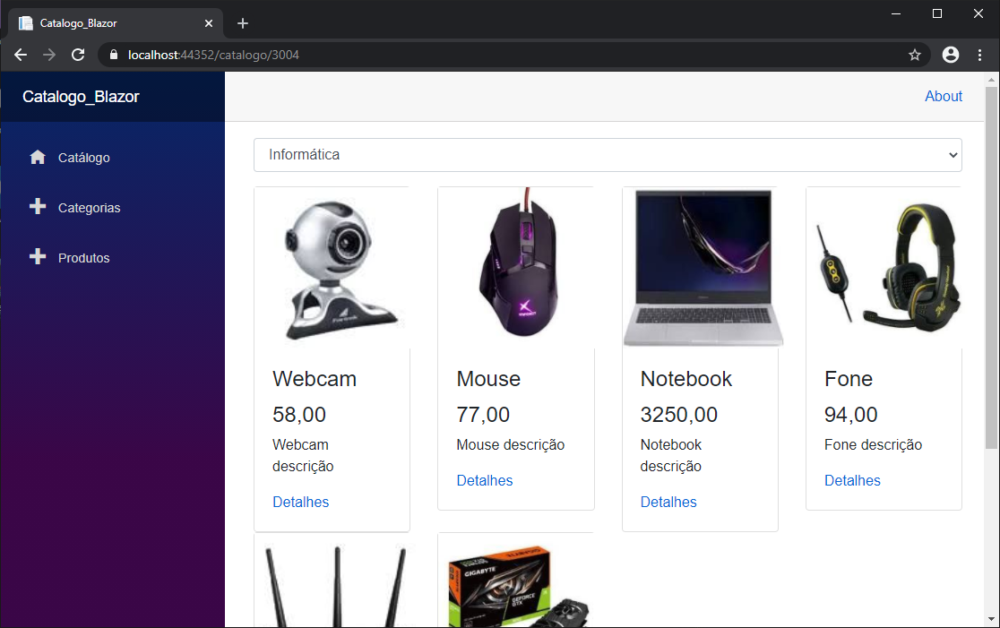

# Blazor - product catalog

Web application of a catalog of various products. The Solution contains a Front-End project using the C # language and Blazor ASP .Net Core technologies, a Back-End project also using the C # language, HTML, Entity Framework Core and SQL Database, and a project with code shared between the applications

## Table of contents

#### Get started
* [Get bits installed and build your first Blazor app](/docs/00-get-started.md)
#### Blazor - Sintaxe Razor e recursos
* coming soon
#### Componentes Blazor
* coming soon
#### Rotas
* coming soon
#### Formulários Blazor
* coming soon
#### Backend com ASP .NET Core e HTTP
* coming soon
#### 7. Implementing Security
* [Managing authentication and authorization](/docs/7.1-managing-authentication-and-authorization.md)

## License

This project is licensed under the MIT License - see the [LICENSE.md](LICENSE.md) file for details
