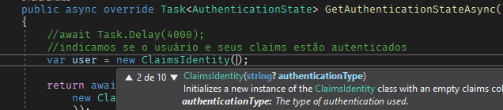
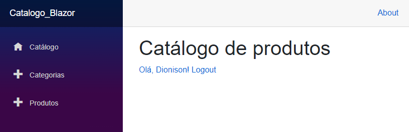

# 7.3 Usando o componente AuthorizeView

Agora vamos usar o componente [AuthorizeView](https://docs.microsoft.com/pt-br/dotnet/api/microsoft.aspnetcore.components.authorization.authorizeview?view=aspnetcore-5.0) para exibir e ocultar  informações com base no estado de autenticação do usuário.  Através dele, vamos definir na aplicação o que um usuário pode ou não pode acessar, dependendo de seu estado de autenticação. O [AuthorizeView](https://docs.microsoft.com/pt-br/dotnet/api/microsoft.aspnetcore.components.authorization.authorizeview?view=aspnetcore-5.0) é um componente Blazor que permite mostrar o conteúdo de componentes filhos com base no status da autenticação do usuário. Podemos usar esse componente assim:

```razor
<AuthorizeView>
    <Authorized>

        @* nesta tag definimos oque o usuário pode ver quando está autenticado *@
        <a href="Identity/Account/Manage">Olá, @context.User.Identity.Name!</a>
        <a href="Identify/Account/LogOut">Logout</a>
    </Authorized>

    <NotAuthorized>
        @* nesta tag definimos oque o usuário pode ver quando NÃO está autenticado *@
        <a href="Identity/Account/Register">Registrar</a> 
        <a href="Identity/Account/Login">Login</a>
    </NotAuthorized>

</AuthorizeView>
```

 Vamos então envolver o conteúdo do nosso componente _Categoria_ no arquivo_ Index.razor _com a tag _ <AuthorizeView>_  seguida da tag <Authorized>. Em se guida vamos também definir uma mensagem para a tag _<NotAuthorized>_  como: 

```razor
<h1>Usuário não autenticado!</h1>
```

Ao salvar e executar o projeto, você irá receber a mensagem acima. Isso porque definimos no nosso provedor um usuário anônimo. Então vamos agora alterar esse comportamento e vamos definir um tipo de autenticação. Abrindo nosso arquivo _DemoAuthStateProvider.cs _ e posicionando o cursor no tipo do nosso usuário (como na imagem abaixo) podemos notar que ele aceita um parâmetro do tipo _string  _que irá representar o tipo de autenticação ([authenticationType](https://docs.microsoft.com/pt-br/dotnet/api/system.security.principal.iidentity.authenticationtype?view=net-5.0#System_Security_Principal_IIdentity_AuthenticationType))



Atribuindo então qualquer valor à esse parâmetro, devemos poder acessar agora o conteúdo restrito pois passaremos a ser um usuário autenticado. Podemos inclusive criar uma declaração genérica como alguns valores:

_Auth\DemoAuthStateProvider.cs_
```c#
var user = new ClaimsIdentity( new List<Claim>() {

                new Claim("chave", "valor"),

                new Claim(ClaimTypes.Name, "Dionison")},

                "demo");
```

Agora podemos acessar as propriedades de nossos objetos [Claim](https://docs.microsoft.com/pt-br/dotnet/api/system.identitymodel.claims.claim?view=netframework-4.8) para personalizar a experiência do usuário. Para testar isso mais facilmente, vamos montar nosso componente  [AuthorizeView](https://docs.microsoft.com/pt-br/dotnet/api/microsoft.aspnetcore.components.authorization.authorizeview?view=aspnetcore-5.0) no arquivo _index.razor_ da raiz de nosso app:

_\index.razor_
```razor
@page "/"

<h1>Catálogo de produtos</h1>

<AuthorizeView>

    <Authorized>

        @* nesta tag definimos oque o usuário pode ver quando está autenticado *@

        <a href="Identity/Account/Manage">Olá, @context.User.Identity.Name!</a>

        <a href="Identify/Account/LogOut">Logout</a>

    </Authorized>

    <NotAuthorized>

        @* nesta tag definimos oque o usuário pode ver quando NÃO está autenticado *@

        <h1>Usuário não autenticado!</h1>

    </NotAuthorized>

</AuthorizeView>
```

E o resultado deverá ser:



Podemos filtrar ainda mais esse acesso, como por exemplo definindo se o usuário atual tem acesso de administrador, podendo assim ter um acesso personalizado. Para isso funcionar, podemos envolver o componente que somente o administrador terá acesso com o nosso componente  [AuthorizeView](https://docs.microsoft.com/pt-br/dotnet/api/microsoft.aspnetcore.components.authorization.authorizeview?view=aspnetcore-5.0)adicionando o atributo _Role. _Vamos fazer isso no botão _"Criar Produto"_ do nosso componente _Produtos_. Vai ficar assim:

_Produtos\index.razor_
```razor
<AuthorizeView Roles="Admin">

    <Authorized>

        <div>

            <a class="btn btn-success" href="produtos/create">Criar Produto</a>

        </div>

    </Authorized>

    <NotAuthorized>

        <h1>Somente usuário Admin pode incluir um produto</h1>

    </NotAuthorized>

</AuthorizeView>
```

 Com essa modificação, mesmo estando autenticados, não conseguiremos incluir um novo produto.

Seremos capazes, se adicionar essa [Claim](https://docs.microsoft.com/pt-br/dotnet/api/system.identitymodel.claims.claim?view=netframework-4.8) na nossa identidade:

_Auth\DemoAuthStateProvider.cs_
```c#
var user = new ClaimsIdentity( new List<Claim>() {

                new Claim("chave", "valor"),

                new Claim(ClaimTypes.Name, "Dionison"),

                new Claim(ClaimTypes.Role, "Admin")},

                "demo");
```

Podemos ainda nesse caso usar a propriedade do usuário [IsInRole](https://docs.microsoft.com/pt-br/dotnet/api/microsoft.visualbasic.applicationservices.user.isinrole?view=net-5.0) para fazer uma verificação da role do usuário e assim poder melhorar sua experiência. Vamos adicionar essa verificação na nossa_ Index _raiz:

_\index.razor_
```razor
<Authorized>

        @* nesta tag definimos oque o usuário pode ver quando está autenticado *@

        <a href="Identity/Account/Manage">Olá, @context.User.Identity.Name!</a>

        <a href="Identify/Account/LogOut">Logout</a>

        <br />

        @if (@context.User.IsInRole("Admin"))

        {

            <text>Usuário Admin</text>

        }

    </Authorized>
```

Vamos dar também ao usuário Admin uma página somente dele. Para isso vamos incluir novo menu no nosso componente _NavMenu_ que vamos chamar de Backup, e vamos também acoplar esse menu com nosso componente [AuthorizeView](https://docs.microsoft.com/pt-br/dotnet/api/microsoft.aspnetcore.components.authorization.authorizeview?view=aspnetcore-5.0)

_Shared\NavMenu.razor_
```razor
<AuthorizeView Roles="Admin">

     <Authorized> 
         <li class="nav-item px-3"> 
             <NavLink class="nav-link" href="backup"> 
                 <span class="oi oi-plus" aria-hidden="true"></span> Backup 
             </NavLink> 
         </li> 
     </Authorized> 

</AuthorizeView>
```

E vamos adicionar esse componente Backup na nossa pasta Page com algum conteúdo a título de teste:

_\Backup.razor_
```razor
@page "/backup"

<h1>Realizar Backup...</h1>

@code {

}
```

Ao executar o aplicativo agora você deverá ser capaz de ver  o novo menu e pagina Backup. Para testar o visual sem sem privilégios de Admin, comente a linha:

_Auth\DemoAuthStateProvider.cs_
```c#
//new Claim(ClaimTypes.Role, "Admin")
```

Perceba entretanto que ainda podemos acessar a página _Backup_ através da url "https://localhost:44352/backup". Teremos que arrumar isso...

